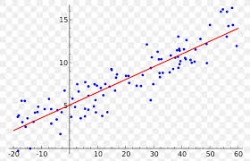

# hello our porfoljo

# [Project 1: Data sciences Rasa chat Bot: Project overview](https://github.com/Jopapy19/rasa_vaderbot)

Overview
This Markdown cheat sheet provides a quick overview of all the Markdown syntax elements. It can’t cover every edge case, so if you need more information about any of these elements, refer to the reference guides for basic syntax and extended syntax.
